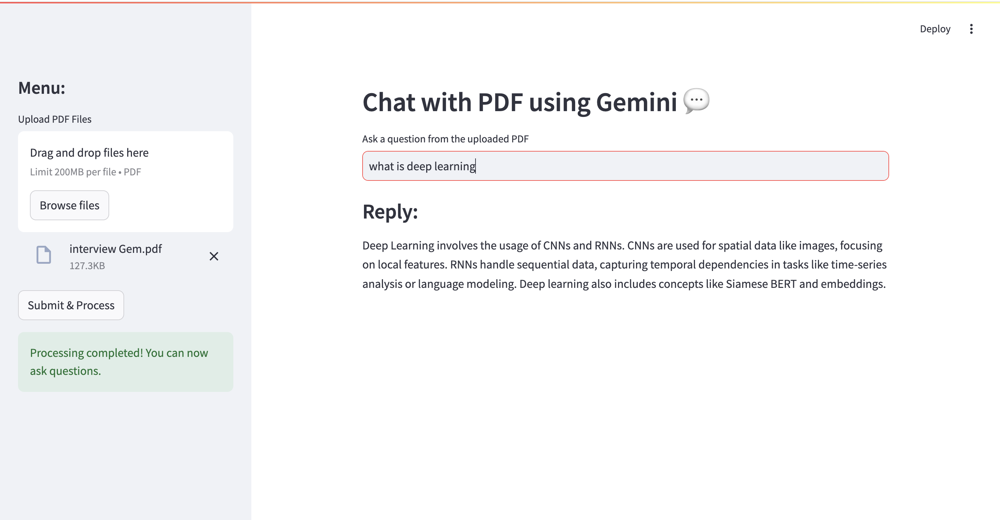
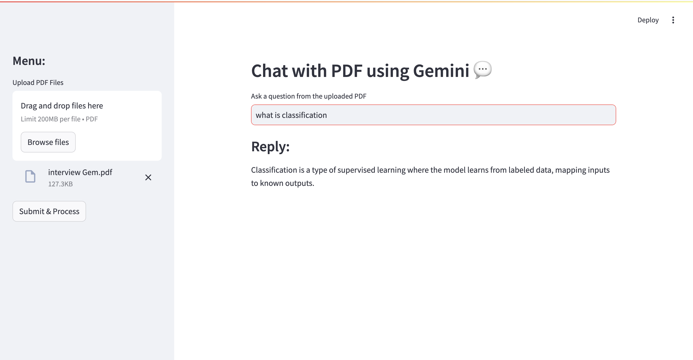

```md
# Chat With Multiple PDFs Using LangChain and Google Gemini Pro  

🚀 A **Streamlit-based PDF Chatbot** that allows users to upload multiple PDF files and ask questions about their content.  
The application leverages **LangChain, FAISS, and Google Gemini Pro** for efficient document retrieval and conversational AI.  

---

## ✨ Features
- 📄 **Upload Multiple PDFs** and extract text from them.  
- 🧩 **Chunking Mechanism** to split text into manageable pieces.  
- 🔍 **Vector Search with FAISS** to find relevant document sections.  
- 🤖 **Google Gemini Pro Integration** for accurate question-answering.  
- 🛡️ **Error Handling** for missing API keys, empty PDFs, and FAISS issues.  

---

## 🚀 Installation and Setup  

### 1️⃣ Clone the Repository  
```sh
git clone https://github.com/saradune6/Chat-With-multiple-Pdf-Documents-with-Langchain-and-Google-Gemini-Pro.git
cd Chat-With-multiple-Pdf-Documents-with-Langchain-and-Google-Gemini-Pro
```

### 2️⃣ Create a Virtual Environment (Optional but Recommended)
```sh
python -m venv venv
source venv/bin/activate  # On macOS/Linux
venv\Scripts\activate  # On Windows
```

### 3️⃣ Install Dependencies  
```sh
pip install -r requirements.txt
```

### 4️⃣ Set Up Google Gemini API Key
Create a `.env` file in the root directory and add your API key:
```sh
GOOGLE_API_KEY=your_google_gemini_api_key
```

---

## 🎯 Usage

### Run the Streamlit App
```sh
streamlit run app.py
```

### Steps to Use the App
1. **Upload one or more PDFs** via the sidebar.  
2. Click **"Submit & Process"** to extract text and generate embeddings.  
3. **Ask questions** in the input box.  
4. The app will retrieve relevant information and generate responses!  

---

## 📦 Dependencies
- `streamlit`
- `PyPDF2`
- `langchain`
- `FAISS`
- `Google Generative AI`
- `python-dotenv`

Install all dependencies using:
```sh
pip install -r requirements.txt
```

---


## ⚠️ Troubleshooting
### 1. Google API Key Error
If you see `GOOGLE_API_KEY is missing`, ensure your `.env` file is correctly set up.  
Run:
```sh
echo $GOOGLE_API_KEY
```
If it's empty, restart your terminal and reload `.env`.

### 2. FAISS Deserialization Issue
If you encounter an error about **dangerous deserialization**, ensure that the FAISS index is generated **only from trusted PDFs**.

### 3. Text Extraction Fails
Some PDFs may have **scanned images instead of selectable text**. Try using an **OCR tool** like [Tesseract OCR](https://github.com/tesseract-ocr/tesseract) before uploading.

---

## 🛠️ Contributing
Pull requests are welcome! Feel free to open issues for improvements or bug fixes. 🚀

---

## 📜 License
This project is licensed under the **MIT License**.
```
